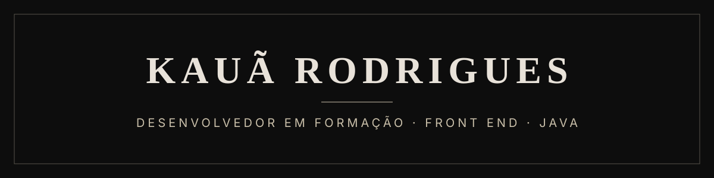

  

Estudo Análise e Desenvolvimento de Sistemas na Faculdade Flamingo e, em paralelo, já entrego sistema no ar pra cliente real. Front end em HTML, CSS e JavaScript com base sólida, back end em Java em acabamento, rumo a full stack.

**Aberto a vaga de desenvolvedor.**

  
  
  

---

### Projetos em destaque

| Projeto | O que é | Link |
|---|---|---|
| **[Açaí Ki Delícia](https://github.com/kauanrodrigueskrvl444-netizen/acai-ki-delicia-site)** | Sistema de pedidos completo: montador de açaí passo a passo com preço em tempo real, cardápio por categoria, carrinho, checkout (Pix, dinheiro ou cartão) e pedido pronto no WhatsApp da loja. Projeto entregue e no ar em domínio próprio. | [acaikideliciaperus.com.br](https://acaikideliciaperus.com.br) |
| **[Portfólio](https://github.com/kauanrodrigueskrvl444-netizen/portfolio)** | Página única em HTML, CSS e JavaScript puro, sem build e sem framework. 300 KB. | [kauarodrigues.netlify.app](https://kauarodrigues.netlify.app) |
| **[Barbearia Rocha (demo)](https://github.com/kauanrodrigueskrvl444-netizen/barbearia-rocha-demo)** | Demo de site com agendamento, feita pra prospecção: o dono recebe o site pronto antes de qualquer conversa. | repositório |
| **[Java](https://github.com/kauanrodrigueskrvl444-netizen/50-Exercicios-Java)** | 95 exercícios resolvidos em Java: condicionais, ternário, switch, arrays. Base do back end que estou fechando. | [50](https://github.com/kauanrodrigueskrvl444-netizen/50-Exercicios-Java) · [45](https://github.com/kauanrodrigueskrvl444-netizen/45-Exercicios-Java) |

---

### Stack

  
  
  
  
  
  
  

**Agora:** fechando o back end em Java pra ligar as interfaces que já faço a uma API própria.

---

Os repositórios numerados (01 a 40) e os marcados como estudo são exercícios guiados que usei pra treinar CSS e JavaScript. Os projetos acima são autorais.
